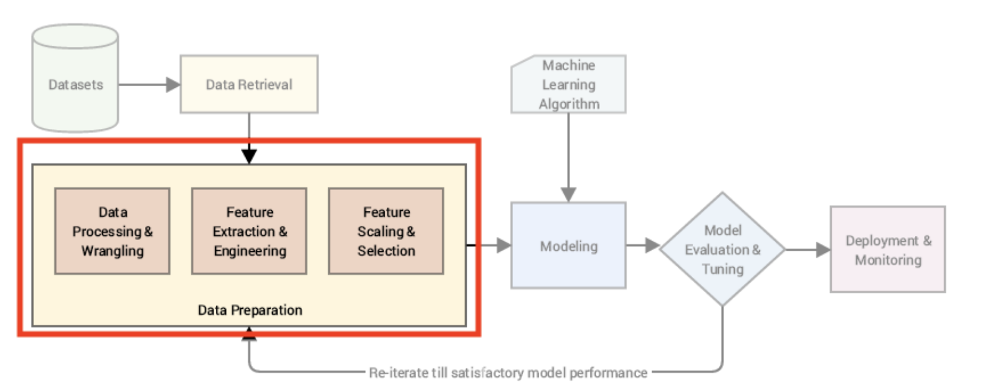

# ML-Data-Preprocessing
How to prepare the data using preprocessing, feature selection &amp; cross validation

We will be doing the data preparation and applying the feature selection techniques on a rather small cars dataset.

🚗 The dataset represents cars, their specificities, and whether they are cheap or expensive

Part of the Plan:
- Finding Duplicates
- Imputing Missing data
- Checking for Outliers
- Data Scaling
- Feature Encoding
- Feature creation
- Feature selection
- Cross validation
- Predicting price of new car

